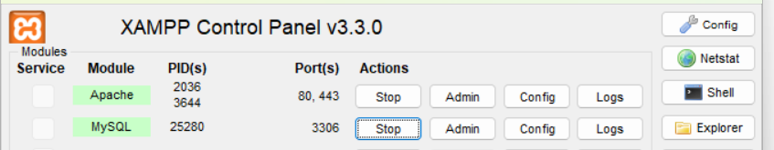

# MySQL CRUD API (Learning Project)

A simple Node.js + Express application demonstrating how to connect to a MySQL database and perform basic CRUD (Create, Read, Update, Delete) operations.
This project was created as part of a Node.js learning exercise on Simplilearn. A link to the course can be found [here](https://www.simplilearn.com/learn-nodejs-basics-free-course-skillup?tag=node.js).

## Technologies Used

Node.js

Express.js

MySQL (mysql NPM package)

#### Testing

To actually see what is going on with the project and test it out, I used XAMPP, simply download it and get the control panel up and running, then turn on 'Apache' and 'MySQL'. If you then go to 'http://localhost/phpmyadmin/' you can see the database go through the CRUD process, depending on which request you go for.



## Installation And Setup

Start by typing these into the terminal:

```bash
git clone https://github.com/AlistairDriscoll/node-mysql
cd node-express
```

Then install dependencies:

```bash
npm install
```

### Running The Server

To run the server simply type:

```bash
node index.js
```

then the server will run on http://localhost:3000


## Database and Table Creation

| Route                   | Description                                      |
| ----------------------- | ------------------------------------------------ |
| **GET /createdb**       | Creates the `nodemysql` database                 |
| **GET /createemployee** | Creates `employee` table (id, name, designation) |

## CRUD Endpoints

#### Create
GET /employee1 inserts an employee (Jake Smith, CEO, id:1) to the database

#### Read
GET /getemployee fetches all rows from the employee table. (Result logs to console, response is a simple text message.)

#### Update
GET /updateemployee/:id updates the employee with id:1's name to Billy Graham.

#### Delete
GET /deleteemployee/:id deleted the employee with id:1

## Notes / Limitations

- Endpoints use GET for everything (including creating, updating, deleting).
In real APIs you'd use POST/PUT/DELETE.

- SQL queries are mostly raw strings — this is fine for learning, but note that in production you'd protect against SQL injection.

- Responses are intentionally simple for clarity.

## What This Project Demonstrates

- Connecting Express to MySQL

- Running SQL queries through db.query()

- Creating databases and tables programmatically

- Basic CRUD operations

- Using route parameters (req.params.id)